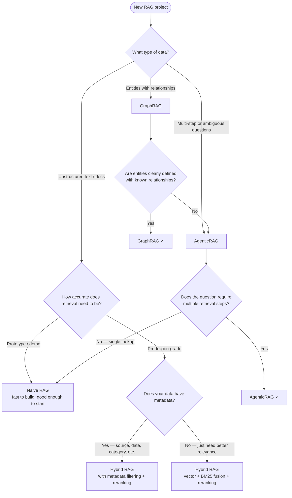

# RAG Patterns

> A hands-on collection of Retrieval-Augmented Generation patterns — from the simplest naive approach to graph-based and agentic retrieval. Each pattern is a self-contained mini project you can run end-to-end.

---

## What is RAG?

**RAG (Retrieval-Augmented Generation)** is a technique where, instead of asking an LLM to answer from memory alone, you first **retrieve** relevant information from an external knowledge source and **pass it as context** to the LLM.

Think of it like an open-book exam: the LLM is the student, and RAG hands it the right pages before it writes the answer. This makes responses grounded, factual, and updatable without retraining the model.

## How RAG Works

The pipeline has three steps:

1. **Index** — Documents are chunked and stored in a searchable format (vector DB, knowledge graph, inverted index, etc.)
2. **Retrieve** — When a query arrives, the system finds the most relevant chunks
3. **Generate** — Retrieved chunks are passed as context to the LLM, which synthesizes a final answer

The critical step is **retrieval**. A great LLM with poor retrieval gives poor answers. Retrieval is where all the interesting patterns emerge.

---

## Why Naive RAG Fails in Production

Naive RAG works beautifully in demos. At scale, it breaks in predictable ways:

### ❌ Embeddings Get It Wrong
Embedding models find *semantically similar* text — but similar ≠ relevant. A query for `"Apple stock price"` might surface chunks about fruit if the corpus lacks context. Embeddings also struggle with exact terms: product IDs, names, error codes, and abbreviations often don't embed well.

### ❌ Cost
At scale, embedding every query and scanning millions of vectors gets expensive — both in compute and embedding API costs. Not every retrieval problem needs a neural network.

### ❌ Not Everything Needs Embeddings
Some data is better queried differently:
- **Structured data** → SQL or metadata filters
- **Exact keywords** → BM25 / inverted index
- **Entity relationships** → graph traversal
- **Multi-step questions** → agent planning

Forcing embeddings on all of these is slower, costlier, and often less accurate.

---

## Patterns in This Repo

| # | Pattern | Folder | Core Idea |
|---|---------|--------|-----------|
| 1 | **Naive RAG** | [`01-naive-rag/`](./01-naive-rag/) | Embed chunks → store in vector DB → retrieve by similarity |
| 2 | **Hybrid RAG** | [`02-hybrid-rag/`](./02-hybrid-rag/) | Vector + BM25 keyword search, metadata filtering, and reranking |
| 3 | **GraphRAG** | [`03-graph-rag/`](./03-graph-rag/) | Build a knowledge graph, retrieve by entity and relationship traversal |
| 4 | **AgenticRAG** | [`04-agentic-rag/`](./04-agentic-rag/) | An LLM agent plans its own retrieval — picks tools, iterates, reasons |

---

## When to Use Which?



---

## Getting Started

Each project folder contains:
- `main.py` — full runnable implementation, heavily commented
- `README.md` — the pattern explained, tradeoffs, when to use it
- `requirements.txt` — Python dependencies
- `.env.example` — env vars needed (API keys, provider config)

### LLM Provider Setup

All projects abstract the LLM so you can use **any OpenAI-compatible provider**:

```bash
# OpenAI (default)
export LLM_PROVIDER=openai
export OPENAI_API_KEY=sk-...

# Groq — fast inference, generous free tier
export LLM_PROVIDER=groq
export GROQ_API_KEY=gsk_...

# Ollama — fully local, no API key needed
export LLM_PROVIDER=ollama
# Start Ollama first: ollama serve && ollama pull llama3.2
```

### Running a Project

```bash
cd 01-naive-rag
pip install -r requirements.txt
cp .env.example .env      # add your API key
python main.py
```